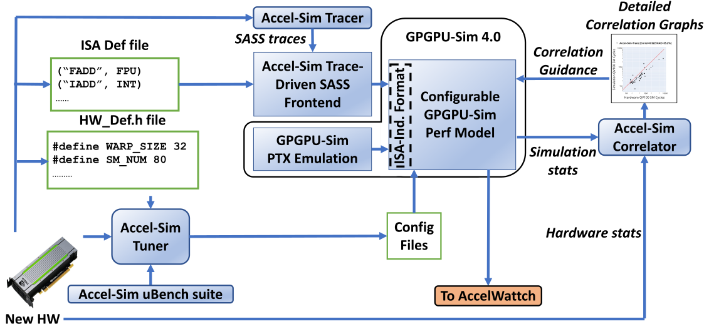

# VI Explore ACCEL-SIM and cache
{: .no_toc }

## Table of contents
{: .no_toc .text-delta }

1. TOC
{:toc}
---

{: .outline}
> At this part, you will learn ACCEL-SIM and knowledge about cache



[ACCEL-SIM](https://accel-sim.github.io/) is a new generation of GPGPU-SIM. The main difference between them is that ACCEL-SIM proposes a new energy model and SASS front end. And ACCEL-SIM provides many python scripts to simplify the execution and output data collection.

## [Build ACCEL-SIM](https://github.com/accel-sim/accel-sim-framework)

Recommend using Docker

{: .highlight}
> You may wonder why we(I) recommend using Docker. 
> Imagine that you need to install many apps and each app rely on different envs (for example, A => gcc8 and B => gcc10). 
> You will soon find that it's very complicated/impossible to build an env that all apps are compatible with each other.
> Then you will think of Docker in which each env is independent from each other.

To get docker image of ACCEL-SIM env
```
docker pull accelsim/ubuntu-18.04_cuda-11
```

To get ACCEL-SIM
```
git clone -b dev https://github.com/accel-sim/gpu-app-collection.git 
```

To build ACCEL-SIM 
```
# in Docker, <CUDA_DIR>=/usr/local/cuda-11.0
export CUDA_INSTALL_PATH=<CUDA_DIR>
export PATH=$CUDA_INSTALL_PATH/bin:$PATH
source ./gpu-simulator/setup_environment.sh
make -j -C ./gpu-simulator/
```

To test your-built ACCEL-SIM 
```
. travis.sh
```

If you have problems about ACCEL-SIM, reference [its webpage](https://accel-sim.github.io/) first.

## A simple and interesting exp about cache

{: .highlight}
> To simplify the exp, we will give detailed steps to implement it.
